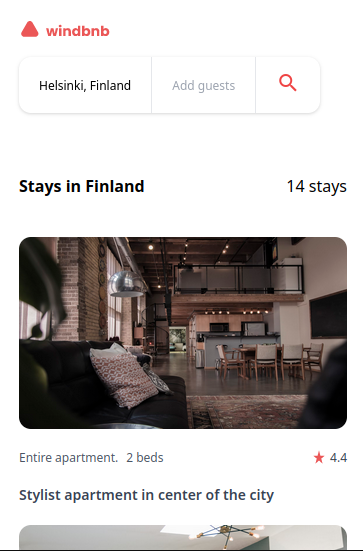

<!-- Please update value in the {}  -->

<h1 align="center">Windbnb</h1>

<div align="center">
   Solution for a challenge from  <a href="http://devchallenges.io" target="_blank">Devchallenges.io</a>.
</div>

<div align="center">
  <h3>
    <a href="https://windbnb-firme.vercel.app/">
      Demo
    </a>
    <span> | </span>
    <a href="https://github.com/FirminoMassango/windbnb">
      Solution
    </a>
    <span> | </span>
    <a href="https://devchallenges.io/challenges/3JFYedSOZqAxYuOCNmYD">
      Challenge
    </a>
  </h3>
</div>

<!-- TABLE OF CONTENTS -->

## Table of Contents

- [Overview](#overview)
  - [Built With](#built-with)
- [User Story](#user-story)
- [Features](#features)
- [How to use](#how-to-use)
- [Contact](#contact)
- [Acknowledgements](#acknowledgements)

<!-- OVERVIEW -->

## Overview

<!--  -->
<h1>Screenshots</h1>





<!-- Introduce your projects by taking a screenshot or a gif. Try to tell visitors a story about your project by answering: -->

- You can see the demo at: https://windbnb-firme.vercel.app/
- This is a project built for educational propose, when I started coding this app I faced some issues such as difficulties while trying to manage global states in React Js, at the end everything did work properly.
- I learnt how to implement global states using react, using a wonderful lib called Zustand, instead of using the built in Context API.
- I'm a web developer and Product designer. When it comes to javascript I do prefer Vue.js because everything looks easier. Currently learning React beacause it's a lib with a larger community, so corporations are often looking for a React developer.

## User Story
- I can see a list of properties
- I can see the property card with a name, rating, apartment type, and super host
- I can open the filter drawer
- I can filter properties by location and number of guests
- I can see the number of filtered items

### Built With

<!-- This section should list any major frameworks that you built your project using. Here are a few examples.-->

- [React](https://reactjs.org/)
- [Zustand](https://github.com/pmndrs/zustand) as React State Manager
- [Vite](https://vitejs.dev/)
- [Tailwind CSS](https://tailwindcss.com/)

<!-- - [Tailwind](https://tailwindcss.com/) -->

## Features

<!-- List the features of your application or follow the template. Don't share the figma file here :) -->

This component was created as a submission to a DevChallenges (https://devchallenges.io/challenges) challenge. The challenge(https://devchallenges.io/challenges/ohgVTyJCbm5OZyTB2gNY) was to build an application to complete the given user stories.

## How To Use

<!-- This is an example, please update according to your application -->

To clone and run this application, you'll need Git(https://git-scm.com) and Node.js(https://nodejs.org/en/download/) (which comes with npm (http://npmjs.com)) installed on your computer. From your command line:

```bash
# Clone this repository
$ git clone https://github.com/FirminoMassango/windbnb
# Install dependencies
$ npm install

# Run the app
$ npm run dev
```

## Acknowledgements

<!-- This section should list any articles or add-ons/plugins that helps you to complete the project. This is optional but it will help you in the future. For exmpale -->

- [Steps to replicate a design with only HTML and CSS](https://devchallenges-blogs.web.app/how-to-replicate-design/)
<!-- - [Node.js](https://nodejs.org/) -->
- [Marked - a markdown parser](https://github.com/chjj/marked)

## Contact

<!-- - Website [your-website.com](https://{your-web-site-link}) -->
- GitHub @FirminoMassango(https://github.com/FirminoMassango)


  
